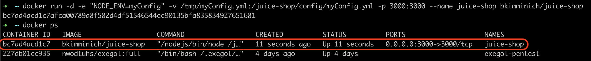

**C'est quoi Juice Shop ?**

Juice Shop est une application web vulnérable pour l'entraînement des testeurs de sécurité. Il est inspiré par les applications modernes qui utilisent des technologies JavaScript lourdes, telles que Angular et Node.js. Juice Shop est conçu pour être utilisé dans des ateliers de formation, des cours de sécurité informatique, des tests de pénétration ou des compétitions de capture du drapeau (CTF).

<!--more-->
## Prérequis

### Spécifications minimales du système

- **RAM**: 256 MO
- **CPU**: 200 millicpu
- **Espace disque libre**: 300 Mo

### Spécifications système recommandées

- **RAM**: 384 MO
- **CPU**: 400 millicpu
- **Espace disque disponible**: 800 Mo
### Logiciels requis

- **Docker**

## Installation

Pour l'instalation de Juice Shop on va utiliser Docker. 

Avant tout nous devons installer Docker sur notre machine. Pour cela, on peut suivre les instructions sur le site officiel de Docker : [Docker](https://docs.docker.com/get-docker/)

Dans un premier temps, on va créer un fichier de configuration `myConfig.yml` pour Juice Shop. 

```yaml
application:
  logo: JuiceShopCTF_Logo.png
  favicon: favicon_ctf.ico
  showVersionNumber: false
  showGitHubLinks: false
  welcomeBanner:
    showOnFirstStart: false
challenges:
  showHints: false
  safetyOverride: true
hackingInstructor:
  isEnabled: false
ctf:
  showFlagsInNotifications: true
  ```

Une fois le fichier de configuration créé, on peut lancer Juice Shop avec la commande suivante :
```bash
docker run -d -e "NODE_ENV=myConfig" -v /tmp/myConfig.yml:/juice-shop/config/myConfig.yml -p 3000:3000 --name juice-shop bkimminich/juice-shop
```


Nous pouvons maintenant accéder à Juice Shop via l'adresse `http://localhost:3000/` dans notre navigateur.


On peut y voir un drapeau rouge sur le logo de Juice Shop. Donc c'est parti pour la chasse aux drapeaux !

## Conclusion

Voila ! Nous avons installé Juice Shop sur notre machine. On peut maintenant s'amuser à tester les différentes vulnérabilités de l'application. Tout ça en Local, bien sûr !
