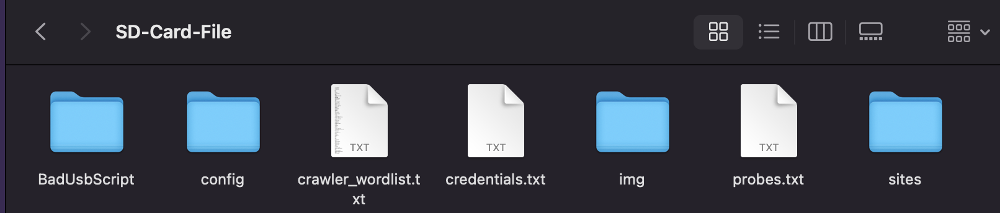

Je fais ce post car il n’y a pas longtemps, j’ai découvert un projet qui m’a beaucoup plu, et je me suis dit que je devais le partager avec vous. Ce projet est le [Evil-M5Core2](https://github.com/7h30th3r0n3/Evil-M5Core2).
<!--more-->

`Evil-M5Project est un outil innovant développé pour les tests éthiques et l'exploration des réseaux WiFi. Il exploite la puissance du dispositif M5Core2 pour scanner, surveiller et interagir avec les réseaux WiFi dans un environnement contrôlé. Ce projet est conçu à des fins éducatives, pour aider à comprendre la sécurité et les vulnérabilités des réseaux.`

## Qu'est-ce que le M5stack Cardputer ?

Cardputer est un ordinateur portable de la taille d'une carte, parfait pour la cybersécurité. Au cœur de Cardputer se trouve le M5StampS3, une mini carte de développement basée sur la puce ESP32-S3. Cardputer est doté d'un puissant processeur double cœur, prend en charge la fonctionnalité Wi-Fi et intègre divers périphériques et capteurs, ce qui le rend idéal pour la vérification fonctionnelle rapide.

### Caractéristiques

- **Microcontrôleur M5StampS3.**
- **Clavier à 56 touches.**
- **Écran TFT de 1,14 pouces.**
- **Haut-parleur de cavité et microphone numérique MEMS SPM1423.**
- **Tube d'émission infrarouge utilisé pour l'interaction de contrôle infrarouge.**
- **Port HY2.0-4P pour connecter et étendre des capteurs I2C.**
- **Emplacement pour carte Micro SD pour étendre l'espace de stockage.**
- **Les batteries lithium intégrées de 120 mAh et 1400 mAh dans la base offrent une longue autonomie.**
- **Base avec aimant, compatible avec l'expansion de trous Lego.**

## Comment l'utiliser ?

Pour utiliser le Cardputer, il nous faut d'abord installer [M5Burner](https://docs.m5stack.com/en/uiflow/m5burner/intro).

M5Burner est une application qui va nous permettre de flasher le firmware sur notre M5stack. Pour cela, il suffit de télécharger le firmware sur le site de M5stack.

On arrive sur une page qui ressemble à ça, on choisit notre carte ; pour ma part, c'est la M5stack Cardputer.  

Une fois notre carte choisie, il nous reste à choisir le firmware que l'on veut flasher sur notre carte.  
Nous en avons plusieurs, pour ma part, j'ai choisi le firmware M5Launcher.  
![M5Launcher]../assets/uploads/2024/2024-doc-M5stack/(m5luncher.png)

Une fois notre firmware choisi, on va regarder à l'aide du gestionnaire de périphériques le port sur lequel est connectée notre carte.  

Cliquez sur le bouton `Burn` pour lancer le flashage du firmware sur notre carte.

On tombe sur cette interface, et on choisit le bon port COM.  

Alors là, pourquoi je vous parle de M5Launcher ?

M5Launcher est un firmware très pratique car il nous permet de lancer plusieurs firmwares sans avoir à les flasher à chaque fois.

## Installation de Evil-Cardputer

Voici les **Étapes** :

## Ce n'est pas fini !

Il nous reste encore une chose à faire : mettre les fichiers dans la carte SD.

Une fois la carte SD connectée, nous allons copier tous les fichiers du GitHub.  

On sélectionne tous les fichiers et on les copie dans la carte SD.  

Si on a tout bien fait, quand on lance le Cardputer et que l'on attend quelques secondes, on tombe sur :

Félicitations, vous avez réussi à installer Evil-Cardputer sur votre M5stack Cardputer.

## Pourquoi Evil-M5Project ?

Dans ce projet, on peut trouver plusieurs outils pour la cybersécurité, comme par exemple :

- **Scan des réseaux WiFi** :  
  Identifier et afficher les réseaux WiFi à proximité.

- **Clonage de réseau** :  
  Vérifier les informations et répliquer les réseaux pour une analyse approfondie.

- **Gestion de portail captif** :  
  Créer et gérer un portail captif pour rediriger les utilisateurs vers une page lors de la connexion.

- **Gestion des identifiants** :  
  Capturer et gérer les identifiants du portail.

- **Serveur Web distant** :  
  Surveiller l'appareil à distance via une interface Web simple qui peut fournir des identifiants et télécharger des portails pour stocker des fichiers sur une carte SD.

- **Sniffing de probes** :  
  Renifler et stocker les probes à proximité sur une carte SD.

- **Attaque Karma** :  
  Tenter une simple attaque Karma sur une probe capturée.

- **Attaque Karma automatisée** :  
  Tenter une attaque Karma sur les probes à proximité de manière automatique.

- **Contrôle par Bluetooth** :  
  Contrôler l'appareil via Bluetooth.

- **Wardriving** :  
  Effectuer du wardriving avec une sortie au format Wigle sur carte SD.

- **Beacon Spam** :  
  Générer plusieurs SSID autour de vous.

- **Deauther** :  
  Envoyer des trames de déauthentification et renifler les handshakes 4-Way ainsi que les PMKID.

- **Sniffing et déauthentification des clients** :  
  Renifler les clients connectés au point d'accès et les désauthentifier automatiquement tout en reniflant les EAPOL.

- **Détection EAPOL/Deauth** :  
  Détecter les paquets de désauthentification, les handshakes 4-Way, les PMKID et les pwnagotchi à proximité.

- **Wall Of Flipper** :  
  Détecter et enregistrer les Flipper Zero avec Bluetooth activé à proximité et détecter les SPAM BLE.

- **Envoi de code Tesla avec RFunit** :  
  Utiliser RFunit pour envoyer des codes Tesla, imitant les capacités de Flipper Zero.

- **Scan de réseau et de ports** :  
  Effectuer des analyses de réseau et de ports pour découvrir des appareils et services, en vérifiant l'état des hôtes.

- **Shell SSH** :  
  Se connecter à des serveurs SSH directement depuis l'appareil, permettant l'exécution de commandes via un shell intégré.

- **Web Crawler** :  
  Explorer des sites Web pour extraire des informations, en s'assurant d'avoir l'autorisation préalable avant utilisation.

- **PwnGrid** :  
  Spammer des visages et des messages sur les appareils pwnagotchi à proximité, provoquant un Denial of Screen PWND.

- **Détecteur de Skimmer** :  
  Détecter les skimmers Bluetooth potentiels en utilisant les modules HC-03, HC-05, et HC-06.

- **BadUSB** :  
  Simuler des attaques BadUSB en émulant les entrées clavier/souris pour exécuter des scripts ou commandes prédéfinis.

## Conclusion

Je trouve que le M5stack Cardputer est un très bon outil pour la cybersécurité. Il est très pratique et facile d'utilisation. Je vous conseille de l'essayer si vous êtes intéressé par la cybersécurité. Pas cher et très pratique.

## Ressources

- [Shop M5stack](https://shop.m5stack.com/products/m5stack-cardputer-kit-w-m5stamps3)
- [Github 7h30th3r0n3](https://github.com/7h30th3r0n3/Evil-M5Core2)
