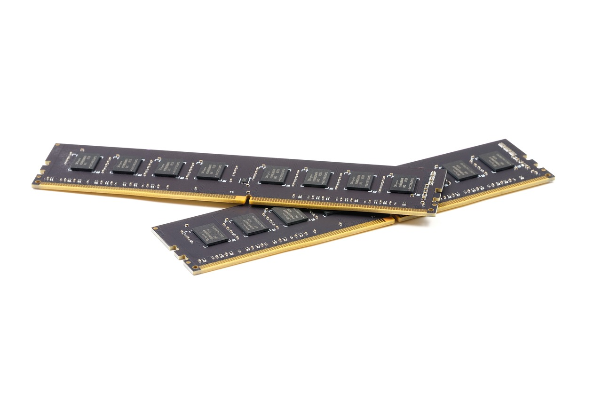
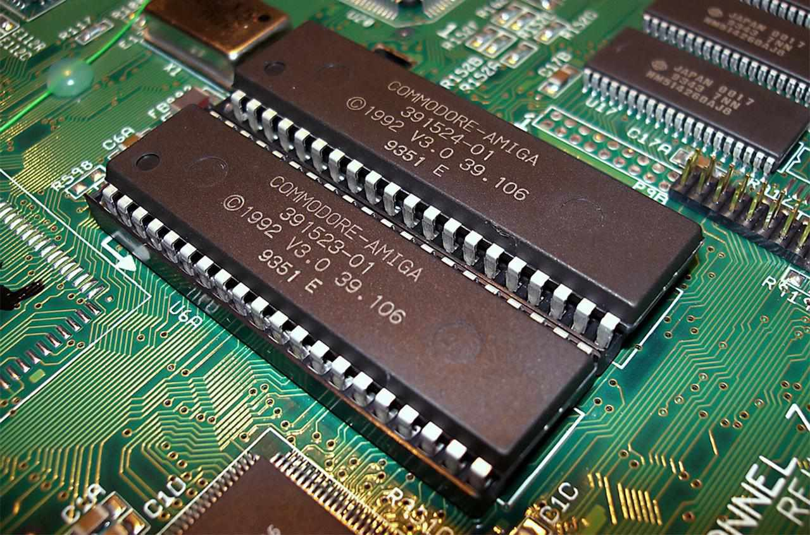
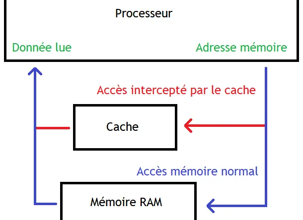

2. [LA MEMOIRE](#)
    - [Differences ](#)
    - [Fabrication](#)

## La Mémoire

La mémoire est un composant essentiel de tout système informatique. Elle permet de stocker des données et des instructions pour les traiter. Il existe plusieurs types de mémoire, chacun ayant ses propres caractéristiques et utilisations. Dans cette section, nous allons explorer les différents types de mémoire et leur fonctionnement.

### Les Différents Types de Mémoire

Il existe plusieurs types de mémoire utilisés dans les systèmes informatiques. Les principaux types de mémoire sont les suivants :

1. **La Mémoire Vive (RAM)** : La mémoire vive, ou RAM (Random Access Memory), est une mémoire volatile utilisée pour stocker des données et des instructions temporaires. La RAM est essentielle pour le fonctionnement d'un système informatique, car elle permet de stocker les données nécessaires au traitement des tâches en cours. La RAM est rapide mais volatile, ce qui signifie qu'elle perd les données stockées lorsqu'elle est éteinte.

2. **La Mémoire Morte (ROM)** : La mémoire morte, ou ROM (Read-Only Memory), est une mémoire non volatile utilisée pour stocker des données et des instructions permanentes. Contrairement à la RAM, la ROM conserve les données stockées même lorsqu'elle est éteinte. La ROM est utilisée pour stocker le BIOS (Basic Input/Output System) et d'autres programmes essentiels au démarrage du système.

3. **La Mémoire Cache** : La mémoire cache est une mémoire intermédiaire utilisée pour stocker des données fréquemment utilisées par le processeur. La mémoire cache est plus rapide que la RAM, ce qui permet d'accélérer l'accès aux données et d'améliorer les performances du système.

### La Fabrication de la Mémoire

**1 Fabrication de la RAM : Version ultra-simplifiée**

Imaginez un gâteau:

- Préparation de la pâte: On commence avec du silicium pur, comme la farine.

- Étaler la pâte: On étale le silicium en une fine couche, comme la pâte à gâteau.

- Découper le circuit: On utilise de la lumière et des produits chimiques pour graver le circuit sur la silicium, comme on découpe des formes dans la pâte.

- Ajouter des ingrédients: On ajoute des impuretés pour améliorer la performance, comme des pépites de chocolat ou des noix dans le gâteau.

- Cuisson: On chauffe le tout pour fixer les éléments, comme la cuisson du gâteau.

- Découper et emballer: On découpe le silicium en barrettes individuelles et on les assemble avec des composants, comme couper le gâteau en parts et les mettre dans des boîtes.

- Vérification finale: On teste chaque barrette pour s'assurer qu'elle fonctionne parfaitement, comme goûter le gâteau pour s'assurer qu'il est délicieux !

ET PAF ! Vous avez de la RAM !

**2 Fabrication de la ROM : Version ultra-simplifiée**

Imaginez un disque de pierre :

- Sculpter le message: On grave les données permanentes dans la pierre, comme un message sur un mur.

- Vérifier la gravure: On vérifie que le message est correct et lisible.

- Découper la pierre: On découpe la pierre en petits morceaux, comme des ROM individuelles.

- Emballer les morceaux: On met chaque morceau dans une boîte protectrice.

ET RE-PAF ! Vous avez de la ROM !

**3 Fabrication de la mémoire cache : Version ultra-simplifiée**

- Imaginez une petite boîte à chaussures ultra-rapide dans votre ordinateur !

- Choisir la boîte: On utilise des transistors très rapides, comme une boîte solide et légère.

- Ranger la boîte: On organise les transistors pour un accès rapide, comme ranger les chaussures par type et par taille.

- Relier les chaussures: On connecte les transistors avec des fils, comme attacher les lacets des chaussures.

- Vérifier la boîte: On teste la boîte pour s'assurer qu'elle est solide, comme vérifier que les chaussures sont bien rangées.

- Mettre la boîte en place: On place la boîte à proximité du processeur pour un accès rapide, comme mettre la boîte à chaussures près de la porte d'entrée.

ET RE-RE-PAF ! Vous avez de la mémoire cache !

