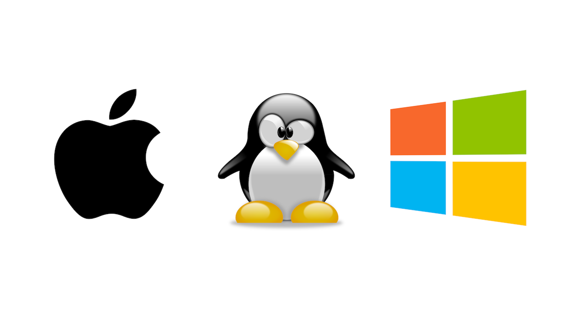
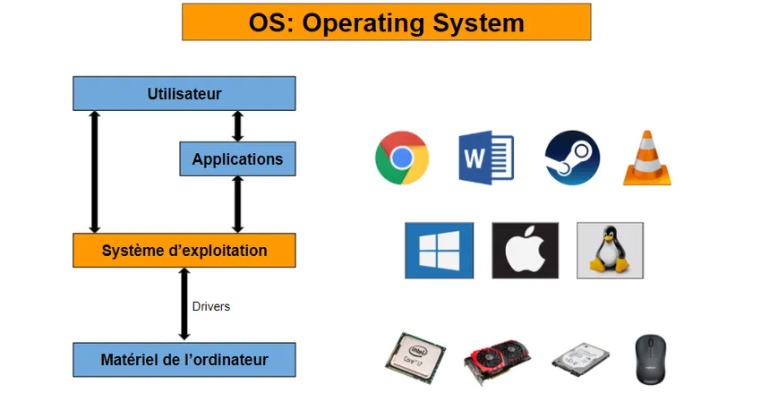
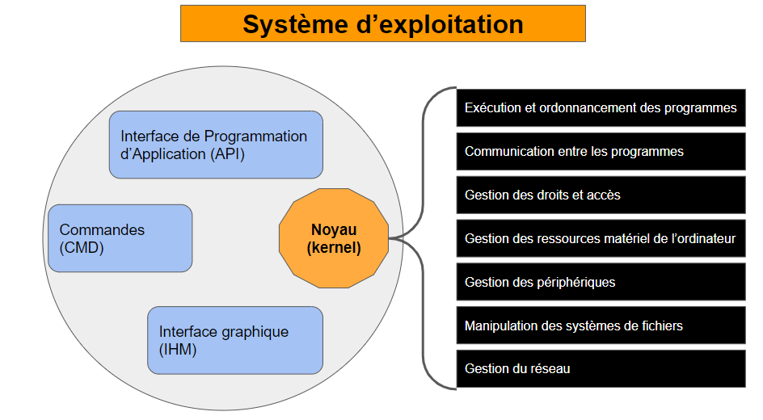
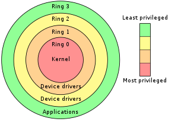
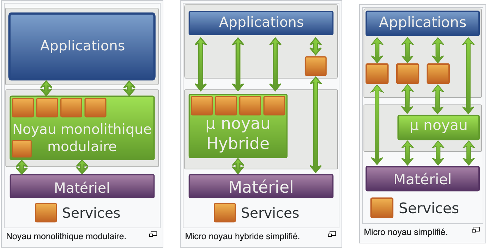

3. [LE SYSTEM D'EXPLOITATION](#)
    - [Fonctionnement et Utilité de l'OS ](#)
    - [Les Differents Noyaux](#)

## Le Système d'Exploitation

Dans cette section, nous allons aborder le système d'exploitation.

Nous pouvons se posé quelques questions sur le système d'exploitation:

- Quels sont les différents types de systèmes d'exploitation ?
- Qu'est-ce qu'un système d'exploitation ?
- Quel est le rôle d'un système d'exploitation ?
- Comment fonctionne un système d'exploitation ?

Alors pas de panique, nous allons répondre à toutes ces questions.

### Les différents types de systèmes d'exploitation

Il existe plusieurs types de systèmes d'exploitation, chacun ayant ses propres caractéristiques et utilisations. Les principaux types de systèmes d'exploitation sont les suivants :

1. **Les systèmes d'exploitation de bureau** : Les systèmes d'exploitation de bureau sont conçus pour les ordinateurs personnels et les postes de travail. Ils offrent une interface graphique conviviale que l'on va appler (`user friendly`) pour interagir avec l'ordinateur et exécuter des programmes. Les principaux systèmes d'exploitation de bureau sont macOS, Linux et Windows.

2. **Les systèmes d'exploitation mobiles** : Les systèmes d'exploitation mobiles sont conçus pour les smartphones et les tablettes. Ils offrent une interface tactile optimisée pour les petits écrans et les appareils mobiles. Les principaux systèmes d'exploitation mobiles sont iOS et Android.

3. **Les systèmes d'exploitation serveur** : Les systèmes d'exploitation serveur sont conçus pour les serveurs informatiques. Ils offrent des fonctionnalités avancées pour gérer les ressources et les services d'un serveur. Les principaux systèmes d'exploitation serveur sont Windows Server et les system d'exploitation basé sur Linux.

- **Windows et coder en C++ et en Assembleur.**

Windows est un système d'exploitation propriétaire développé par Microsoft. Il est basé sur le noyau Windows NT, qui a été introduit en 1993. Windows est largement utilisé dans le monde entier pour les ordinateurs personnels, les serveurs, les smartphones et les tablettes. Il est connu pour son interface graphique conviviale et ses fonctionnalités avancées.

- **Linux et MacOS en C et Unix en C.**

Linux est un système d'exploitation open-source basé sur le noyau Linux, qui a été introduit en 1991 par Linus Torvalds. Linux est largement utilisé dans le monde entier pour les serveurs, les supercalculateurs, les smartphones et les objets connectés. Il est connu pour sa stabilité, sa sécurité et sa flexibilité.

### Fonctionnement et Utilité de l'OS

Déja c'est quoi un système d'exploitation : Nous pouvons dire que le système d'exploitation est un ensemble de programmes qui permettent à l'utilisateur d'interagir avec l'ordinateur. Sont role va être de gérer les ressources matérielles de l'ordinateur (processeur, mémoire, disque dur, etc.) et de fournir une interface utilisateur pour exécuter des programmes.

Pour faire plus simple on peut dire que le système d'exploitation c'est comme un chef d'orchestre qui coordonne les différentes parties de l'ordinateur pour que tout fonctionne correctement.

Acrocher vous, nous allons voir comment fonctionne un système d'exploitation !

- Dans se shema nous pouvons voir que le système d'exploitation est composé de plusieurs parties :

- Le Materiel : C'est la partie physique de l'ordinateur, c'est à dire le processeur, la mémoire, le disque dur, etc.

- Le Systeme d'Exploitation : C'est la partie logicielle de l'ordinateur, c'est à dire les programmes qui permettent de gérer le matériel et d'interagir avec l'utilisateur.

- Les Applications : Ce sont les programmes que l'utilisateur exécute pour effectuer des tâches spécifiques, comme naviguer sur internet, éditer des documents, etc.

- L'Utilisateur : C'est la personne qui utilise l'ordinateur pour effectuer des tâches.

Lorsque vous lancez des logiciels sur votre ordinateur, comme un navigateur web ou un jeu, ils ne peuvent pas utiliser directement la mémoire ou le processeur. Ils doivent d'abord passer par le système d'exploitation, qui contrôle l'accès à ces ressources comme un chef d'orchestre.

OK jusqu'ici tout va bien, mais comment ça se passe dans le système d'exploitation ?

Mientenant on va voire ça de plus près.

Bon comme on peux voir notre systeme d'exploitation a plain de petite partie go tout detaillier.

Un user va lancer une application, l'application va passer par l'API pour acceder au noyau, le noyau va gerer les ressources materielles et fournir les services de base aux applications.

- **Le Noyau** : C'est la partie centrale du système d'exploitation, qui gère les ressources matérielles de l'ordinateur et fournit des services de base aux applications. Le noyau est responsable de la gestion de la mémoire, du processeur, des périphériques, des fichiers, etc.

- **Les Interfaces de programation (API)** : Ce sont des ensembles de fonctions et de procédures qui permettent aux applications d'interagir avec le système d'exploitation. Les API fournissent un moyen standard pour les applications d'accéder aux ressources matérielles et aux services du système d'exploitation. On peux les voire comme des ponts entre les applications et le noyau.

- **CMD (Command Line Interface)** : C'est une interface utilisateur en ligne de commande qui permet d'interagir avec le système d'exploitation en tapant des commandes textuelles. La CLI est utilisée pour effectuer des tâches avancées et de la programmation système. Ici on va pouvoir taper des commandes pour executer des taches. Si vous voulez essayer ouvré un terminal et faite `ls` ou `dir` pour windows Bien jouer a vous vous venez de voir les fichier de votre machine!

- **Interface Graphique (GUI)** : C'est une interface utilisateur graphique qui permet d'interagir avec le système d'exploitation en utilisant des éléments visuels comme des fenêtres, des boutons et des menus. La GUI est utilisée pour effectuer des tâches courantes et pour une utilisation conviviale. Ici on va pouvoir cliquer sur des icones pour executer des taches. Par exemple pour ouvrir un fichier on va cliquer sur l'icone du fichier.

OK voyons maintenant un peux de securité.

C'est quoi un Ring dans un système d'exploitation ?

Un ring est un niveau de privilège dans un système d'exploitation qui détermine les ressources auxquelles un programme peut accéder. Il existe plusieurs niveaux de privilège, appelés anneaux, qui contrôlent l'accès aux ressources matérielles et logicielles de l'ordinateur.

- **Ring 0 (Noyau)** : C'est le niveau de privilège le plus élevé, qui permet d'accéder à toutes les ressources matérielles et logicielles de l'ordinateur. Le noyau du système d'exploitation s'exécute dans cet anneau pour gérer les ressources et fournir des services aux applications.

- **Ring 1 (Pilotes)** : C'est un niveau de privilège intermédiaire, qui permet d'accéder à certaines ressources matérielles et logicielles de l'ordinateur. Les pilotes de périphériques s'exécutent dans cet anneau pour gérer les périphériques matériels et fournir des services aux applications.

- **Ring 2 (Services)** : C'est un niveau de privilège intermédiaire, qui permet d'accéder à certaines ressources matérielles et logicielles de l'ordinateur. Certains

- **Ring 3 (Applications)** : C'est le niveau de privilège le plus bas, qui permet d'accéder à un ensemble limité de ressources matérielles et logicielles de l'ordinateur. Les applications utilisateur s'exécutent dans cet anneau pour effectuer des tâches spécifiques.

Les ring sont fais pour proteger le systeme d'exploitation des applications malveillantes. En effet si une application malveillante s'execute dans un ring superieur elle pourra avoir acces a toutes les ressources de l'ordinateur et ca c'est pas bon.

Comme vu dans le Post sur les processeurs la machine ne comprend pas le language humain, elle comprend que le language machine. Le système d'exploitation va permettre de traduire les commandes que vous tapez en language machine pour que la machine puisse les comprendre.

### Les Differents Noyaux

comme vu plus haut le noyau est la partie centrale du système d'exploitation, qui gère les ressources matérielles de l'ordinateur et fournit des services de base aux applications. Il existe plusieurs types de noyaux, chacun ayant ses propres caractéristiques et utilisations. Les principaux types de noyaux sont les suivants :

1. **Les noyaux monolithiques** : Les noyaux monolithiques sont conçus pour exécuter toutes les fonctions du système d'exploitation dans un seul espace de mémoire. Ils sont rapides et efficaces, mais ils sont également plus vulnérables aux pannes et aux erreurs. Les principaux noyaux monolithiques sont Linux et Windows.

2. **Les noyaux micro-noyaux** : Les noyaux micro-noyaux sont conçus pour exécuter les fonctions de base du système d'exploitation dans un espace de mémoire minimal. Ils sont plus stables et sécurisés, mais ils sont également plus lents et moins efficaces. Les principaux noyaux micro-noyaux sont QNX et MINIX.

3. **Les noyaux hybrides** : Les noyaux hybrides sont conçus pour combiner les avantages des noyaux monolithiques et des noyaux micro-noyaux. Ils exécutent certaines fonctions du système d'exploitation dans un espace de mémoire minimal, tandis que d'autres fonctions sont exécutées dans un espace de mémoire plus large. Les principaux noyaux hybrides sont Windows NT et macOS.

- **Linux** : Linux est un noyau open-source basé sur le noyau Linux, qui a été introduit en 1991 par Linus Torvalds. Linux est largement utilisé dans le monde entier pour les serveurs, les supercalculateurs, les smartphones et les objets connectés. Il est connu pour sa stabilité, sa sécurité et sa flexibilité. Exemple de Linux : Ubuntu.

- **Windows NT** : Windows NT est un noyau propriétaire développé par Microsoft. Il est basé sur le noyau Windows NT, qui a été introduit en 1993. Windows NT est largement utilisé dans le monde entier pour les ordinateurs personnels, les serveurs, les smartphones et les tablettes. Il est connu pour son interface graphique conviviale et ses fonctionnalités avancées. Exemple de Windows NT : Windows 10.

- **macOS** : macOS est un noyau propriétaire développé par Apple. Il est basé sur le noyau Unix, qui a été introduit en 1971. macOS est utilisé sur les ordinateurs personnels d'Apple, comme les MacBook et les iMac. Il est connu pour son interface graphique élégante et ses fonctionnalités avancées. Exemple de macOS : MacBook.

- **QNX** : QNX est un noyau propriétaire développé par BlackBerry. Il est basé sur le noyau QNX, qui a été introduit en 1982. QNX est largement utilisé dans le monde entier pour les systèmes embarqués, les voitures connectées et les appareils médicaux. Il est connu pour sa stabilité, sa sécurité et sa fiabilité. Exemple de voiture connectée : Tesla.

- **MINIX** : MINIX est un noyau open-source développé par Andrew Tanenbaum. Il est basé sur le noyau MINIX, qui a été introduit en 1987. MINIX est largement utilisé dans le monde entier pour l'enseignement et la recherche en informatique. Il est connu pour sa simplicité, sa modularité et sa fiabilité. Exemple de MINIX : Raspberry Pi.

### Conclusion

Le système d'exploitation est un composant essentiel de tout système informatique. Il permet de gérer les ressources matérielles de l'ordinateur et de fournir une interface utilisateur pour exécuter des programmes. Il existe plusieurs types de systèmes d'exploitation, chacun ayant ses propres caractéristiques et utilisations. Les principaux types de systèmes d'exploitation sont les systèmes d'exploitation de bureau, les systèmes d'exploitation mobiles et les systèmes d'exploitation serveur. Chaque type de système d'exploitation a ses propres avantages et inconvénients, en fonction des besoins de l'utilisateur et des applications.

#### Sources

- [Wikibooks](https://fr.wikibooks.org/wiki/Les_syst%C3%A8mes_d'exploitation/Le_noyau_d'un_syst%C3%A8me_d'exploitation)
- [codeur-pro](https://codeur-pro.fr/les-systemes-dexploitation/)
- [GitHub](https://github.com/torvalds/linux)
- [Microsoft](https://www.microsoft.com/fr-fr/windows)