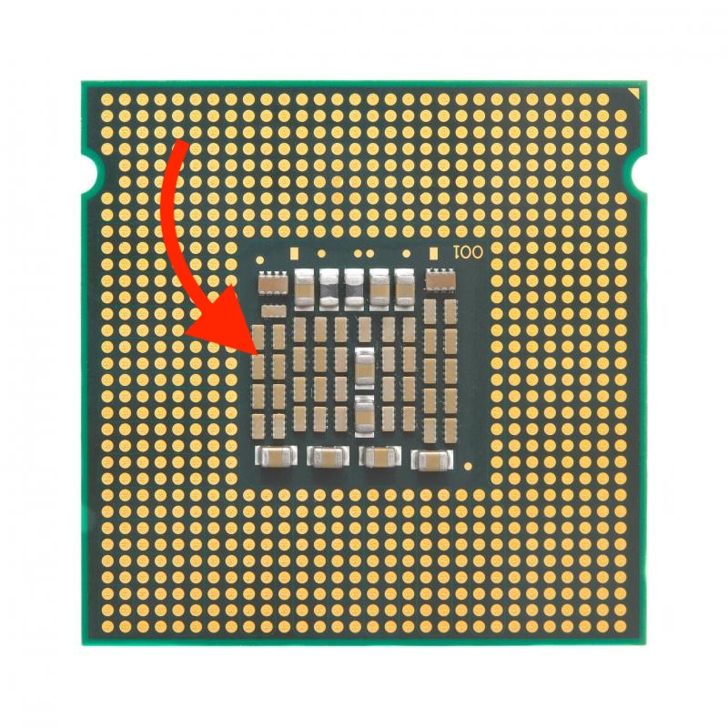
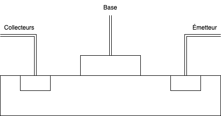
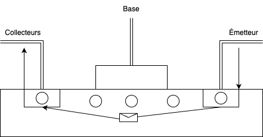
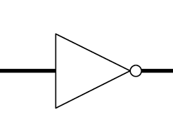
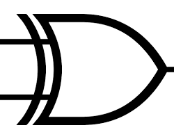
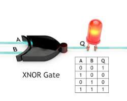

# Plan

1. [LE PROCESSEUR](#le-processeur) 
    - [Le Binaire](#le-binaire)
    - [Les Transistors](#)
    - [Les Portes logiques](#)
    - [La Fabrication](#)

## Le Processeur

Le processeur est le cerveau de l'ordinateur. Il prend les instructions d'un programme et effectue les calculs nécessaires sur les données pour que l'ordinateur puisse fonctionner. Imaginons que votre ordinateur est une cuisine et que le processeur est le cuistot.

* Il reçoit les recettes (programmes) que vous lui donnez.
* Il lit et suit les instructions (calcule, compare, manipule).
* Il utilise les ingrédients (données) pour préparer le plat (résultat final).
* Il coordonne le tout pour que le repas soit prêt à temps (exécute les tâches rapidement).

Plus votre cuistot est habile et bien équipé (processeur puissant avec plusieurs cœurs), plus il pourra préparer des plats compliqués (logiciels exigeants) et des menus complets (multitâche) rapidement et efficacement.

Le processeur est présent dans la plupart des appareils électroniques: ordinateurs, smartphones, tablettes, consoles de jeux, etc. On le surnomme souvent CPU (Central Processing Unit) en anglais.

### Le Binaire

Le processeur ne comprend pas notre langage naturel. Il ne sait pas lire le français, l'anglais ou toute autre langue humaine. Il ne comprend que le langage binaire, une suite de 0 et de 1. Chaque instruction est traduite en binaire pour que le processeur puisse la comprendre et l'exécuter. C'est pourquoi les programmes et les données sont stockés sous forme binaire dans la mémoire de l'ordinateur.

Dans la vie de tous les jour nous comptons en base 10 (décimal) avec les chiffres de 0 à 9. En binaire, nous comptons en base 2 avec seulement 2 chiffres: 0 et 1. C'est un système de numération différent, mais tout aussi efficace pour les ordinateurs.

Voici un tableau qui montre la correspondance entre les nombres décimaux et binaires:

| décimal      | binaire | commentaire     |
| :---        |    :----:   |          ---: |
| 0      | 0       | zéro   |
| 1   | 1        | un = base puissance zéro (valable pour toutes les bases, donc deux et dix)      |
| 2      | 10       | deux = deux puissance un (un zéro derrière le 1)   |
| 3   | 11        |       |
| 4      | 100       | quatre = deux puissance deux (deux zéros derrière le 1)   |
| 5   | 101        |       |
| 6      | 110       |    |
| 7   | 111        |       |
| 8      | 1000       | huit = deux puissance trois (trois zéros derrière le 1)   |
| 9   | 1001        |       |

On donne à chaque bit une puissance de deux, comme cette suite 1, 2, 4, 8, 16, 32, 64. Pour obtenir le nombre 7, on additionne les trois premiers bits; pour obtenir 6, on additionne seulement le bit de poids 4 et le bit de poids 2.

En France et dans quelques pays francophones on utilise le mot BITS dans le reste du monde on appel ça un BYTE 

8 bits = 1 octet = 1 byte

Pour rappel, un BITS c'est une seule valeur une seule unité et un BYTE c'est 8 BITS donc 8 valeurs qui peuvent être 0 ou 1.

#### calcul binaire

Les nombres binaires se lisent de droite à gauche !

#### binaires a décimal

Prenons un nombre binaire : `11000101`

| BITS  | calcul          | resultat |
| :--------------- |:---------------:| -----:|
| 1  |   2^0         |  1 |
| 0  |   2^1               |   2 |
| 1  |   2^2            |    4 |
| 0  |   2^3         |  8 |
| 0  |   2^4               |   16 |
| 0  |   2^5            |    32 |
| 1  |   2^6          |  64 |
| 1  |   2^7               |   128 |
| TOTAL  |   128 + 64 + 4 + 1               |   197 |

Une fois que l'on a calculé les valeurs de chaque bits on les additionne on enlève les valeurs des bits qui sont à 0 ça donne 

#### décimal a binaire

Prenon un nombre décimal : `197`

Pour convertir un nombre decimal en binaire la question à se poser c'est combien de fois 2 rentre dans le nombre decimal et combien reste t'il. 

Exemple : 

197 on le divise part 2 ça donne 98,5 on arrondi a 98 et on garde le reste 1

    98 + 98 + 1 
    On garde le 1
98 on le divise part 2 ça donne 49 
    
        49 + 49 + 0
        On garde le 0
49 on le divise part 2 ça donne 24
    
            24 + 24 + 1
            On garde le 1
24 on le divise part 2 ça donne 12

                12 + 12 + 0
                On garde le 0
12 on le divise part 2 ça donne 6

                    6 + 6 + 0
                    On garde le 0
6 on le divise part 2 ça donne 3

                        3 + 3 + 0
                        On garde le 0
3 on le divise part 2 ça donne 1

                            1 + 1 + 1
                            On garde le 1

Si on regarde les restes de chaque division on obtient `11000101`

Bien joué vous avez converti un nombre decimal en binaire !

### Les Transistors

Alors accrochez vous ça va être un peu technique.

Voila un transistor:

Les transistors sont des composants électroniques qui servent à contrôler le courant électrique. Ils sont utilisés dans de nombreux appareils électroniques, y compris les processeurs.

Les transistors peuvent être utilisés pour amplifier un signal électrique ou pour agir comme un interrupteur. Dans un processeur, les transistors sont utilisés pour contrôler le flux de courant électrique et effectuer des opérations logiques.

Exemple :

Ici on a un transistor qui est composé de 3 parties : la base, l'émetteur et le collecteur. 

Lorsque la base est alimentée en courant, le transistor laisse passer le courant entre l'émetteur et le collecteur. Sinon, le courant est bloqué. En revanche, un transistor PNP fonctionne à l'envers : il laisse passer le courant lorsque la base n'est pas alimentée et le bloque lors de l'aliment de la base.

### Les Portes logiques

Les portes logiques sont des circuits électroniques fondamentaux qui effectuent des opérations booléennes simples sur un ou plusieurs signaux d'entrée. Elles constituent la base de tous les circuits numériques modernes, des microprocesseurs aux mémoires en passant par les circuits logiques programmables.

**Fonctionnement des portes logiques**

Chaque porte logique possède une ou plusieurs entrées et une seule sortie. Les entrées reçoivent des signaux binaires, c'est-à-dire des signaux qui ne peuvent prendre que deux valeurs : 0 ou 1. La sortie de la porte produit un nouveau signal binaire en fonction de la combinaison des valeurs d'entrée.

Le fonctionnement d'une porte logique est défini par sa table de vérité, qui indique la valeur de sortie pour chaque combinaison possible de valeurs d'entrée. Par exemple, la table de vérité de la porte NOT, qui inverse l'entrée, est la suivante :

| Entrée | Sortie |
|---|---|
| 0 | 1 |
| 1 | 0 |

#### Types de portes logiques

Il existe plusieurs types de portes logiques, chacune avec sa propre fonction et son propre symbole graphique. Les plus courantes sont :

- **Porte NOT (ou inverseur)**: inverse l'entrée (0 devient 1 et 1 devient 0). 

- **Porte OR (ou disjonction)**: la sortie est 1 si au moins une des entrées est 1, sinon elle est 0.

- **Porte AND (ou conjonction**): la sortie est 1 uniquement si toutes les entrées sont 1, sinon elle est 0.

- **Porte NAND (non-AND)**: la sortie est l'inverse d'une porte AND.

- **Porte NOR (non-OR)**: la sortie est l'inverse d'une porte OR.

- **Porte XOR (ou exclusivité ou)**: la sortie est 1 si une seule des entrées est 1, mais pas les deux. 

- **Porte XNOR (non-XOR)**: la sortie est 1 si les deux entrées sont identiques (0 ou 1), sinon elle est 0. 

#### Implémentation des portes logiques

Les portes logiques peuvent être implémentées à l'aide de divers composants électroniques, tels que des transistors, des diodes et des résistances. La technologie la plus utilisée pour la fabrication des circuits numériques modernes est la technologie CMOS (Complementary Metal-Oxide-Semiconductor), qui permet de miniaturiser les portes logiques et de les intégrer en grand nombre sur des puces de silicium.

#### Applications des portes logiques

- **Microprocesseurs**: les portes logiques constituent les éléments de base des unités de traitement arithmétique et logique (UAL) des microprocesseurs, qui effectuent les calculs et les opérations logiques.

- **Mémoires**: les portes logiques sont utilisées pour contrôler l'accès aux cellules de mémoire et pour décoder les adresses mémoire.

- **Circuits logiques programmables**: les circuits logiques programmables (FPGA et CPLD) sont composés de portes logiques reconfigurables qui peuvent être programmées pour réaliser différentes fonctions logiques.

- **Systèmes de communication numérique**: les portes logiques sont utilisées pour coder et décoder les signaux numériques, pour moduler et démoduler les signaux radio, et pour implémenter des protocoles de communication.

#### En résumé

Ces portes logiques, combinées entre elles, permettent de réaliser des opérations plus complexes comme compter, comparer, ou stocker des informations. Elles sont à la base de tous les circuits numériques, des ordinateurs aux smartphones !

### La Fabrication



## Conclusion

Nous avons vu que le processeur est le cerveau de l'ordinateur, qu'il fonctionne en binaire, qu'il est composé de transistors et de portes logiques, et qu'il est fabriqué à l'aide de la technologie CMOS. Le processeur est un composant essentiel de tout appareil électronique, et il est utilisé dans de nombreux domaines, de l'informatique à la téléphonie en passant par l'automobile et l'aéronautique.

## notion

- bits = un bit peut représenter aussi bien une alternative logique, exprimé par faux et vrai, qu'un « chiffre binaire »

- octet = 8 bits

- byte = 8 bits

- transistor = composant électronique qui sert à contrôler le courant électrique

- porte logique = circuit électronique qui effectue des opérations booléennes simples sur un ou plusieurs signaux d'entrée

- binaire = système de numération en base 2

- décimal = système de numération en base 10

- CPU = Central Processing Unit, unité centrale de traitement

- CMOS = Complementary Metal-Oxide-Semiconductor, technologie de fabrication des circuits intégrés

## source

https://fr.wikipedia.org/wiki/Syst%C3%A8me_binaire
https://hyperelectronic.net/fr/encyclopedie/porte-logique/
https://fr.m.wikipedia.org/wiki/Fichier:XOR_ANSI.svg
https://www.sciencephoto.fr/image/12918337-XNOR-logic-gate-diagram